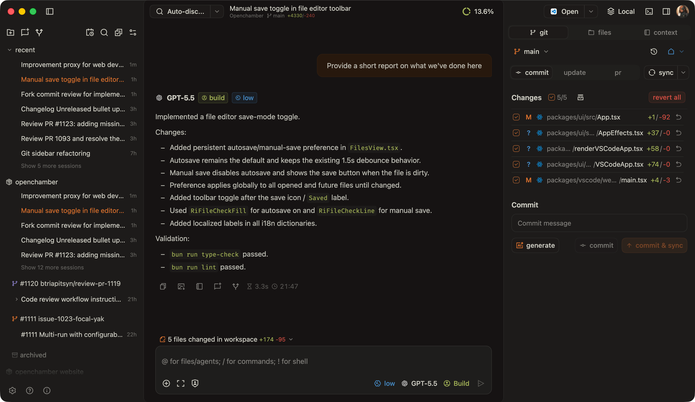
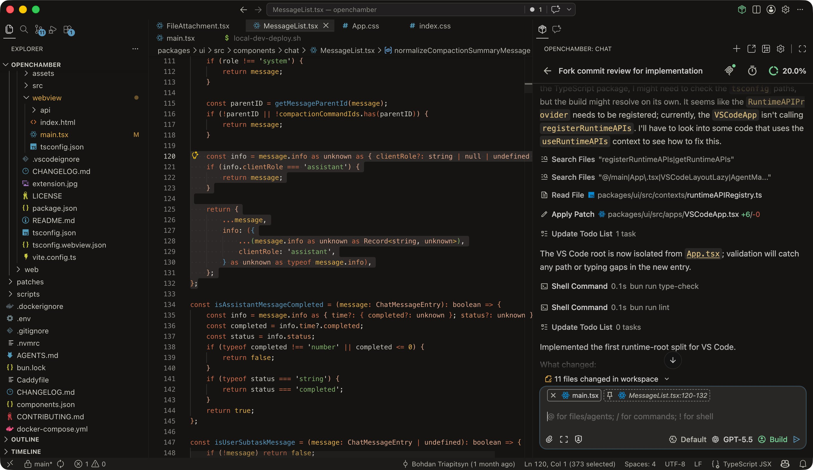

# DevRyan

## **OpenCode, everywhere.** Desktop. Browser. Phone.

### A rich interface for [OpenCode](https://opencode.ai). Review diffs, manage agents, run dev servers, and keep the big picture while your AI codes.

More screenshots

## Why use DevRyan?

- **Cross-device continuity**: Start in TUI, continue on tablet/phone, return to terminal - same session
- **Remote access**: Use OpenCode from anywhere via browser
- **Familiarity**: A visual alternative for developers who prefer GUI workflows