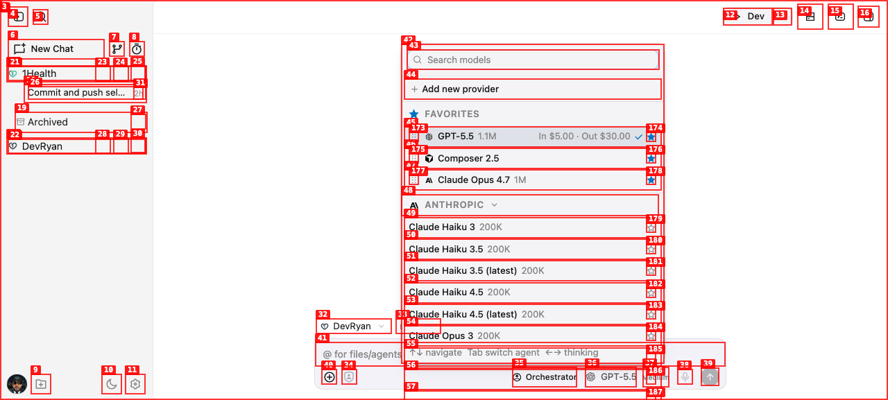

# Dogfood Report: DevRyan

| Field | Value |
|-------|-------|
| **Date** | 2026-05-27 |
| **App URL** | http://127.0.0.1:5180 |
| **Session** | devryan-qa |
| **Scope** | Core app runtime, mode selection, agent/model/provider switching, implied/non-implied mode behavior, and sub-agent task flows |

## Summary

| Severity | Count |
|----------|-------|
| Critical | 0 |
| High | 0 |
| Medium | 0 |
| Low | 1 |
| **Total** | **1** |

## Issues

### ISSUE-001: Selected model pricing is duplicated in the model picker

| Field | Value |
|-------|-------|
| **Severity** | low |
| **Category** | visual / content |
| **URL** | http://127.0.0.1:5180/ |
| **Repro Video** | N/A |

**Description**

The currently selected OpenAI GPT-5.5 row renders the same input/output price text twice (`In $5.00 · Out $30.00In $5.00 · Out $30.00`). Other rows only render pricing once. Expected: each model row should show one pricing string.

**Fix Status**

Fixed in `packages/ui/src/components/ui/TextLoop.tsx` by hiding sizing-only text from assistive tech and allowing fixed-width callers to omit the sizing copy. Verified with the model picker accessibility snapshot after HMR.

**Repro Steps**

1. Navigate to the DevRyan app at http://127.0.0.1:5180/ and open the model picker.
   

2. **Observe:** the selected `GPT-5.5` row shows duplicated pricing text.
